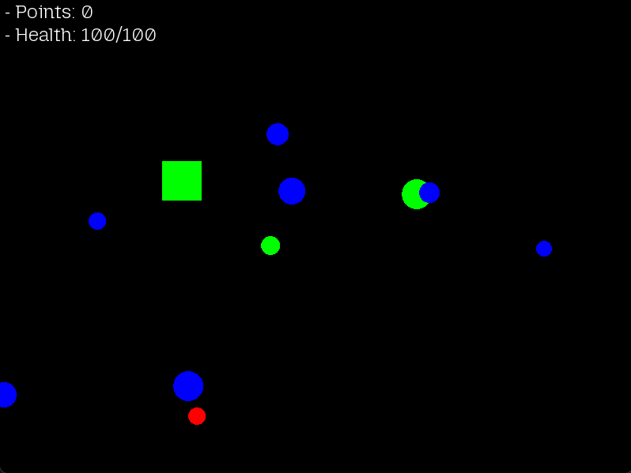

# 🎮 SFML 2D Games Collection (C++)

This repository contains a collection of **5 simple 2D games built with SFML in C++**.  
Currently, only the **first two games** are finished, while the others are still in progress.

---

## 📌 Game 1 – Enemy Clicker (Finished ✅)

In this game, enemies fall from the top of the screen, and the player must click them before they hit the ground.  

- **Enemy Types**  
  - 🟩 Green: Large, slow, 1 point  
  - 🟦 Blue: Medium, faster, 3 points  
  - 🟥 Red: Small, fast, 5 points  

- **Mechanics**  
  - Enemies spawn randomly with different probabilities (Green 60%, Blue 30%, Red 10%)  
  - Player earns points by clicking enemies  
  - Player loses health if enemies reach the bottom  
  - Game ends when health reaches 0  

## 🎮 Controls
- **Left Mouse Button** – Click enemies to destroy them  
- **ESC** – Quit the game  

## 📸 Screenshot (Game 1)

---
## 📌 Game 2 – SwagBall Collector (Finished ✅)

In this game, you control a green player square, collect point balls, avoid damaging balls, and heal with special ones. The game ends when your health reaches 0.  

- **Ball Types**  
  - 🔵 Default: +1 point  
  - 🔴 Damaging: -10 HP  
  - 🟢 Healing: +10 HP (up to max)  

- **Mechanics**  
  - Balls spawn randomly with different probabilities  
    - Default: 60%  
    - Damaging: 20%  
    - Healing: 20%  
  - Player earns points by collecting default balls  
  - Player loses health by colliding with damaging balls  
  - Player can restore health with healing balls 
  - Game ends when health reaches 0  

## 🎮 Controls
- **W / A / S / D** – Move player  
- **ESC** – Quit the game  

## 📸 Screenshot (Game 2)

---

## 🛠️ Requirements

- C++17 (or later)  
- [SFML 2.5+](https://www.sfml-dev.org/download.php)  

Make sure you have SFML installed and linked properly in your compiler/IDE.

---

## 🎯 Roadmap
- [x] Game 1 – Enemy Clicker   
- [x] Game 2 – SwagBalls Collector
- [ ] Game 3 – TBA  
- [ ] Game 4 – TBA  
- [ ] Game 5 – TBA  
