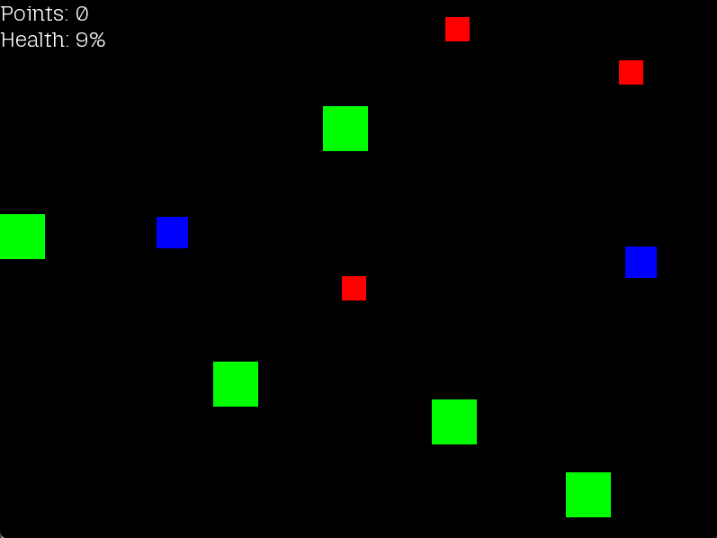

# 🎮 SFML 2D Games Collection (C++)

This repository contains a collection of **5 simple 2D games built with SFML in C++**.  
Currently, only the **first game** is finished, while the others are still in progress.

---

## 📌 Game 1 – Enemy Clicker (Finished ✅)

In this game, enemies fall from the top of the screen, and the player must click them before they hit the ground.  

- **Enemy Types**  
  - 🟩 Green: Large, slow, 1 point  
  - 🟦 Blue: Medium, faster, 3 points  
  - 🟥 Red: Small, fast, 5 points  

- **Mechanics**  
  - Enemies spawn randomly with different probabilities (Green 60%, Blue 30%, Red 10%)  
  - Player earns points by clicking enemies  
  - Player loses health if enemies reach the bottom  
  - Game ends when health reaches 0  

---

## 🎮 Controls
- **Left Mouse Button** – Click enemies to destroy them  
- **ESC** – Quit the game  

---

## 🛠️ Requirements

- C++17 (or later)  
- [SFML 2.5+](https://www.sfml-dev.org/download.php)  

Make sure you have SFML installed and linked properly in your compiler/IDE.

---

## 🚀 Build & Run

### Linux / MacOS
```bash
g++ main.cpp Game.cpp -o game -lsfml-graphics -lsfml-window -lsfml-system
./game
```

### Windows (WinGW version)
```bash
g++ main.cpp Game.cpp -o game.exe -lsfml-graphics -lsfml-window -lsfml-system
game.exe
```


---

## 🎯 Roadmap
- [x] Game 1 – Enemy Clicker  
- [ ] Game 2 – TBD  
- [ ] Game 3 – TBD  
- [ ] Game 4 – TBD  
- [ ] Game 5 – TBD  

---

## 📸 Screenshots (Game 1)

